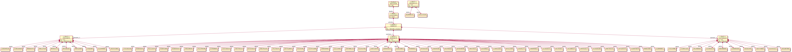
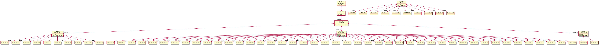
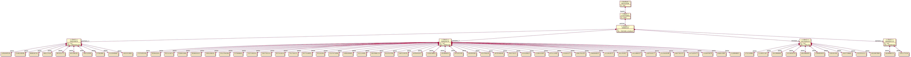
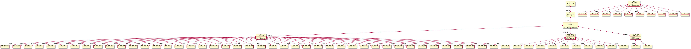
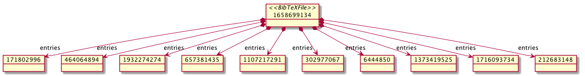
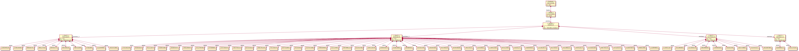
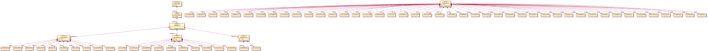
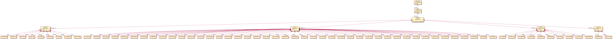
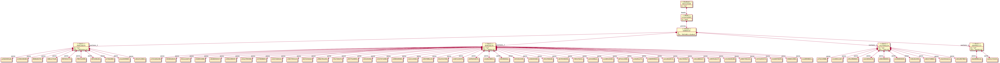

# Inconsistencies
## random10-single-1

Inconsistency *Deleting paragraph*:

* in object **364639279**:

	* docbook.impl.Sect1Impl@15bbf42f (id: se2) (title: Authors list) 

* feature **paras**:

* **REMOVE** the value 

Transformation step: `Main`

* Source match: 

* Target match: 

* Target match (after change): 

## random10-single-3

Inconsistency *Swapping paragraph*:

* in object **1427040229**:

	* docbook.impl.Sect1Impl@550ee7e5 (id: se3) (title: Titles List) 

* feature **paras**:

* **MOVE** the value 

	* **docbook.impl.ParaImpl@5acf93bb (id: _aWp6ZamjEemmTKUyi9-xmA) (content: This Lime Tree Bower)**

Transformation step: `Main`

* Source match: 

* Target match: 

* Target match (after change): 

## random10-single-4

Inconsistency *Deleting sections*:

* in object **16868310:

	* docbook.impl.ArticleImpl@10163d6 (id: null) (title: BibTeXML to DocBook) 

* feature **sections_1**:

* **REMOVE** the value 

	* ****

Transformation step: `Main`

* Source match: 

* Target match: 

* Target match (after change): 

## random10-single-4

Inconsistency *Deleting paragraph*:

* in object **364639279:

	* docbook.impl.Sect1Impl@15bbf42f (id: se2) (title: Authors list) 

* feature **paras**:

* **REMOVE** the value 

	* **docbook.impl.ParaImpl@66d3eec0 (id: _aWp6aqmjEemmTKUyi9-xmA) (content: Abram Carter III)**

Transformation step: `Main`

* Source match: 

* Target match: 

* Target match (after change): 

## random10-single-4

Inconsistency *Deleting paragraph*:

* in object **364639279:

	* docbook.impl.Sect1Impl@15bbf42f (id: se2) (title: Authors list) 

* feature **paras**:

* **REMOVE** the value 

	* **docbook.impl.ParaImpl@1e04fa0a (id: _aWqhcKmjEemmTKUyi9-xmA) (content: Alejandro Roob)**

Transformation step: `Main`

* Source match: 

* Target match: 

* Target match (after change): 

## random10-single-4

Inconsistency *Deleting paragraph*:

* in object **364639279:

	* docbook.impl.Sect1Impl@15bbf42f (id: se2) (title: Authors list) 

* feature **paras**:

* **REMOVE** the value 

	* **docbook.impl.ParaImpl@1af2d44a (id: _aWqhcamjEemmTKUyi9-xmA) (content: Allan Anderson)**

Transformation step: `Main`

* Source match: 

* Target match: 

* Target match (after change): 

## random10-single-4

Inconsistency *Deleting paragraph*:

* in object **364639279:

	* docbook.impl.Sect1Impl@15bbf42f (id: se2) (title: Authors list) 

* feature **paras**:

* **REMOVE** the value 

	* **docbook.impl.ParaImpl@18d87d80 (id: _aWqhcqmjEemmTKUyi9-xmA) (content: Andrea Marvin DVM)**

Transformation step: `Main`

* Source match: 

* Target match: 

* Target match (after change): 

## random10-single-4

Inconsistency *Deleting paragraph*:

* in object **364639279:

	* docbook.impl.Sect1Impl@15bbf42f (id: se2) (title: Authors list) 

* feature **paras**:

* **REMOVE** the value 

	* **docbook.impl.ParaImpl@618425b5 (id: _aWqhc6mjEemmTKUyi9-xmA) (content: Armando Conn Sr.)**

Transformation step: `Main`

* Source match: 

* Target match: 

* Target match (after change): 

## random10-single-4

Inconsistency *Deleting paragraph*:

* in object **364639279:

	* docbook.impl.Sect1Impl@15bbf42f (id: se2) (title: Authors list) 

* feature **paras**:

* **REMOVE** the value 

	* **docbook.impl.ParaImpl@58695725 (id: _aWqhdKmjEemmTKUyi9-xmA) (content: Augustine Mueller V)**

Transformation step: `Main`

* Source match: 

* Target match: 

* Target match (after change): 

## random10-single-4

Inconsistency *Deleting paragraph*:

* in object **364639279:

	* docbook.impl.Sect1Impl@15bbf42f (id: se2) (title: Authors list) 

* feature **paras**:

* **REMOVE** the value 

	* **docbook.impl.ParaImpl@543588e6 (id: _aWqhdamjEemmTKUyi9-xmA) (content: Ayana Towne)**

Transformation step: `Main`

* Source match: 

* Target match: 

* Target match (after change): 

## random10-single-4

Inconsistency *Deleting paragraph*:

* in object **364639279:

	* docbook.impl.Sect1Impl@15bbf42f (id: se2) (title: Authors list) 

* feature **paras**:

* **REMOVE** the value 

	* **docbook.impl.ParaImpl@f5acb9d (id: _aWqhdqmjEemmTKUyi9-xmA) (content: Cecelia Schumm)**

Transformation step: `Main`

* Source match: 

* Target match: 

* Target match (after change): 

## random10-single-4

Inconsistency *Deleting paragraph*:

* in object **364639279:

	* docbook.impl.Sect1Impl@15bbf42f (id: se2) (title: Authors list) 

* feature **paras**:

* **REMOVE** the value 

	* **docbook.impl.ParaImpl@4fb3ee4e (id: _aWqhd6mjEemmTKUyi9-xmA) (content: Chung Hammes)**

Transformation step: `Main`

* Source match: 

* Target match: 

* Target match (after change): 

## random10-single-4

Inconsistency *Deleting paragraph*:

* in object **364639279:

	* docbook.impl.Sect1Impl@15bbf42f (id: se2) (title: Authors list) 

* feature **paras**:

* **REMOVE** the value 

	* **docbook.impl.ParaImpl@5d7148e2 (id: _aWqheKmjEemmTKUyi9-xmA) (content: Clemmie Ward)**

Transformation step: `Main`

* Source match: 

* Target match: 

* Target match (after change): 

## random10-single-4

Inconsistency *Deleting paragraph*:

* in object **364639279:

	* docbook.impl.Sect1Impl@15bbf42f (id: se2) (title: Authors list) 

* feature **paras**:

* **REMOVE** the value 

	* **docbook.impl.ParaImpl@25fb8912 (id: _aWqheamjEemmTKUyi9-xmA) (content: Donald Robel)**

Transformation step: `Main`

* Source match: 

* Target match: 

* Target match (after change): 

## random10-single-4

Inconsistency *Deleting paragraph*:

* in object **364639279:

	* docbook.impl.Sect1Impl@15bbf42f (id: se2) (title: Authors list) 

* feature **paras**:

* **REMOVE** the value 

	* **docbook.impl.ParaImpl@7c24b813 (id: _aWqheqmjEemmTKUyi9-xmA) (content: Dulce Zieme Jr.)**

Transformation step: `Main`

* Source match: 

* Target match: 

* Target match (after change): 

## random10-single-4

Inconsistency *Deleting paragraph*:

* in object **364639279:

	* docbook.impl.Sect1Impl@15bbf42f (id: se2) (title: Authors list) 

* feature **paras**:

* **REMOVE** the value 

	* **docbook.impl.ParaImpl@2c35e847 (id: _aWrIgKmjEemmTKUyi9-xmA) (content: Ema Wilkinson)**

Transformation step: `Main`

* Source match: 

* Target match: 

* Target match (after change): 

## random10-single-4

Inconsistency *Deleting paragraph*:

* in object **364639279:

	* docbook.impl.Sect1Impl@15bbf42f (id: se2) (title: Authors list) 

* feature **paras**:

* **REMOVE** the value 

	* **docbook.impl.ParaImpl@7bd4937b (id: _aWrIgamjEemmTKUyi9-xmA) (content: Ethan Marvin)**

Transformation step: `Main`

* Source match: 

* Target match: 

* Target match (after change): 

## random10-single-4

Inconsistency *Deleting paragraph*:

* in object **364639279:

	* docbook.impl.Sect1Impl@15bbf42f (id: se2) (title: Authors list) 

* feature **paras**:

* **REMOVE** the value 

	* **docbook.impl.ParaImpl@21e360a (id: _aWrIgqmjEemmTKUyi9-xmA) (content: Francesca O'Conner)**

Transformation step: `Main`

* Source match: 

* Target match: 

* Target match (after change): 

## random10-single-4

Inconsistency *Deleting paragraph*:

* in object **364639279:

	* docbook.impl.Sect1Impl@15bbf42f (id: se2) (title: Authors list) 

* feature **paras**:

* **REMOVE** the value 

	* **docbook.impl.ParaImpl@5ba3f27a (id: _aWrIg6mjEemmTKUyi9-xmA) (content: Gemma Sanford DVM)**

Transformation step: `Main`

* Source match: 

* Target match: 

* Target match (after change): 

## random10-single-4

Inconsistency *Deleting paragraph*:

* in object **364639279:

	* docbook.impl.Sect1Impl@15bbf42f (id: se2) (title: Authors list) 

* feature **paras**:

* **REMOVE** the value 

	* **docbook.impl.ParaImpl@58d75e99 (id: _aWrIhKmjEemmTKUyi9-xmA) (content: Glinda Rodriguez)**

Transformation step: `Main`

* Source match: 

* Target match: 

* Target match (after change): 

## random10-single-4

Inconsistency *Deleting paragraph*:

* in object **364639279:

	* docbook.impl.Sect1Impl@15bbf42f (id: se2) (title: Authors list) 

* feature **paras**:

* **REMOVE** the value 

	* **docbook.impl.ParaImpl@74751b3 (id: _aWrIhamjEemmTKUyi9-xmA) (content: Hosea Marks)**

Transformation step: `Main`

* Source match: 

* Target match: 

* Target match (after change): 

## random10-single-4

Inconsistency *Deleting paragraph*:

* in object **364639279:

	* docbook.impl.Sect1Impl@15bbf42f (id: se2) (title: Authors list) 

* feature **paras**:

* **REMOVE** the value 

	* **docbook.impl.ParaImpl@741a8937 (id: _aWrIhqmjEemmTKUyi9-xmA) (content: Ian Jerde)**

Transformation step: `Main`

* Source match: 

* Target match: 

* Target match (after change): 

## random10-single-4

Inconsistency *Deleting paragraph*:

* in object **364639279:

	* docbook.impl.Sect1Impl@15bbf42f (id: se2) (title: Authors list) 

* feature **paras**:

* **REMOVE** the value 

	* **docbook.impl.ParaImpl@306e95ec (id: _aWrIh6mjEemmTKUyi9-xmA) (content: Janise Schneider)**

Transformation step: `Main`

* Source match: 

* Target match: 

* Target match (after change): 

## random10-single-4

Inconsistency *Deleting paragraph*:

* in object **364639279:

	* docbook.impl.Sect1Impl@15bbf42f (id: se2) (title: Authors list) 

* feature **paras**:

* **REMOVE** the value 

	* **docbook.impl.ParaImpl@52af26ee (id: _aWrIiKmjEemmTKUyi9-xmA) (content: Javier Berge)**

Transformation step: `Main`

* Source match: 

* Target match: 

* Target match (after change): 

## random10-single-4

Inconsistency *Deleting paragraph*:

* in object **364639279:

	* docbook.impl.Sect1Impl@15bbf42f (id: se2) (title: Authors list) 

* feature **paras**:

* **REMOVE** the value 

	* **docbook.impl.ParaImpl@6fd83fc1 (id: _aWrIiamjEemmTKUyi9-xmA) (content: Jeanice Hoeger)**

Transformation step: `Main`

* Source match: 

* Target match: 

* Target match (after change): 

## random10-single-4

Inconsistency *Deleting paragraph*:

* in object **364639279:

	* docbook.impl.Sect1Impl@15bbf42f (id: se2) (title: Authors list) 

* feature **paras**:

* **REMOVE** the value 

	* **docbook.impl.ParaImpl@4f2b503c (id: _aWrIiqmjEemmTKUyi9-xmA) (content: Jewell Labadie DDS)**

Transformation step: `Main`

* Source match: 

* Target match: 

* Target match (after change): 

## random10-single-4

Inconsistency *Deleting paragraph*:

* in object **364639279:

	* docbook.impl.Sect1Impl@15bbf42f (id: se2) (title: Authors list) 

* feature **paras**:

* **REMOVE** the value 

	* **docbook.impl.ParaImpl@bae7dc0 (id: _aWrvkKmjEemmTKUyi9-xmA) (content: Josiah Hudson)**

Transformation step: `Main`

* Source match: 

* Target match: 

* Target match (after change): 

## random10-single-4

Inconsistency *Deleting paragraph*:

* in object **364639279:

	* docbook.impl.Sect1Impl@15bbf42f (id: se2) (title: Authors list) 

* feature **paras**:

* **REMOVE** the value 

	* **docbook.impl.ParaImpl@209da20d (id: _aWrvkamjEemmTKUyi9-xmA) (content: Karry Legros)**

Transformation step: `Main`

* Source match: 

* Target match: 

* Target match (after change): 

## random10-single-4

Inconsistency *Deleting paragraph*:

* in object **364639279:

	* docbook.impl.Sect1Impl@15bbf42f (id: se2) (title: Authors list) 

* feature **paras**:

* **REMOVE** the value 

	* **docbook.impl.ParaImpl@e15b7e8 (id: _aWrvkqmjEemmTKUyi9-xmA) (content: Karyl Stehr)**

Transformation step: `Main`

* Source match: 

* Target match: 

* Target match (after change): 

## random10-single-4

Inconsistency *Deleting paragraph*:

* in object **364639279:

	* docbook.impl.Sect1Impl@15bbf42f (id: se2) (title: Authors list) 

* feature **paras**:

* **REMOVE** the value 

	* **docbook.impl.ParaImpl@1b2abca6 (id: _aWrvk6mjEemmTKUyi9-xmA) (content: Lesley Johns)**

Transformation step: `Main`

* Source match: 

* Target match: 

* Target match (after change): 

## random10-single-4

Inconsistency *Deleting paragraph*:

* in object **364639279:

	* docbook.impl.Sect1Impl@15bbf42f (id: se2) (title: Authors list) 

* feature **paras**:

* **REMOVE** the value 

	* **docbook.impl.ParaImpl@6392827e (id: _aWrvlKmjEemmTKUyi9-xmA) (content: Lewis Schneider)**

Transformation step: `Main`

* Source match: 

* Target match: 

* Target match (after change): 

## random10-single-4

Inconsistency *Deleting paragraph*:

* in object **364639279:

	* docbook.impl.Sect1Impl@15bbf42f (id: se2) (title: Authors list) 

* feature **paras**:

* **REMOVE** the value 

	* **docbook.impl.ParaImpl@2ed2d9cb (id: _aWrvlamjEemmTKUyi9-xmA) (content: Lindsey Rogahn)**

Transformation step: `Main`

* Source match: 

* Target match: 

* Target match (after change): 

## random10-single-4

Inconsistency *Deleting paragraph*:

* in object **364639279:

	* docbook.impl.Sect1Impl@15bbf42f (id: se2) (title: Authors list) 

* feature **paras**:

* **REMOVE** the value 

	* **docbook.impl.ParaImpl@d5b810e (id: _aWrvlqmjEemmTKUyi9-xmA) (content: Maggie Huels)**

Transformation step: `Main`

* Source match: 

* Target match: 

* Target match (after change): 

## random10-single-4

Inconsistency *Deleting paragraph*:

* in object **364639279:

	* docbook.impl.Sect1Impl@15bbf42f (id: se2) (title: Authors list) 

* feature **paras**:

* **REMOVE** the value 

	* **docbook.impl.ParaImpl@43dac38f (id: _aWrvl6mjEemmTKUyi9-xmA) (content: Malcom Thiel)**

Transformation step: `Main`

* Source match: 

* Target match: 

* Target match (after change): 

## random10-single-4

Inconsistency *Deleting paragraph*:

* in object **364639279:

	* docbook.impl.Sect1Impl@15bbf42f (id: se2) (title: Authors list) 

* feature **paras**:

* **REMOVE** the value 

	* **docbook.impl.ParaImpl@342c38f8 (id: _aWrvmKmjEemmTKUyi9-xmA) (content: Merissa Johns)**

Transformation step: `Main`

* Source match: 

* Target match: 

* Target match (after change): 

## random10-single-4

Inconsistency *Deleting paragraph*:

* in object **364639279:

	* docbook.impl.Sect1Impl@15bbf42f (id: se2) (title: Authors list) 

* feature **paras**:

* **REMOVE** the value 

	* **docbook.impl.ParaImpl@c88a337 (id: _aWrvmamjEemmTKUyi9-xmA) (content: Mikel Homenick)**

Transformation step: `Main`

* Source match: 

* Target match: 

* Target match (after change): 

## random10-single-4

Inconsistency *Deleting paragraph*:

* in object **364639279:

	* docbook.impl.Sect1Impl@15bbf42f (id: se2) (title: Authors list) 

* feature **paras**:

* **REMOVE** the value 

	* **docbook.impl.ParaImpl@5d0a1059 (id: _aWrvmqmjEemmTKUyi9-xmA) (content: Mr. Catarina McKenzie)**

Transformation step: `Main`

* Source match: 

* Target match: 

* Target match (after change): 

## random10-single-4

Inconsistency *Deleting paragraph*:

* in object **364639279:

	* docbook.impl.Sect1Impl@15bbf42f (id: se2) (title: Authors list) 

* feature **paras**:

* **REMOVE** the value 

	* **docbook.impl.ParaImpl@485966cc (id: _aWsWoKmjEemmTKUyi9-xmA) (content: Mrs. Abram Greenfelder)**

Transformation step: `Main`

* Source match: 

* Target match: 

* Target match (after change): 

## random10-single-4

Inconsistency *Deleting paragraph*:

* in object **364639279:

	* docbook.impl.Sect1Impl@15bbf42f (id: se2) (title: Authors list) 

* feature **paras**:

* **REMOVE** the value 

	* **docbook.impl.ParaImpl@1de76cc7 (id: _aWsWoamjEemmTKUyi9-xmA) (content: Nadia Cole)**

Transformation step: `Main`

* Source match: 

* Target match: 

* Target match (after change): 

## random10-single-4

Inconsistency *Deleting paragraph*:

* in object **364639279:

	* docbook.impl.Sect1Impl@15bbf42f (id: se2) (title: Authors list) 

* feature **paras**:

* **REMOVE** the value 

	* **docbook.impl.ParaImpl@54bff557 (id: _aWsWoqmjEemmTKUyi9-xmA) (content: Noemi Simonis)**

Transformation step: `Main`

* Source match: 

* Target match: 

* Target match (after change): 

## random10-single-4

Inconsistency *Deleting paragraph*:

* in object **364639279:

	* docbook.impl.Sect1Impl@15bbf42f (id: se2) (title: Authors list) 

* feature **paras**:

* **REMOVE** the value 

	* **docbook.impl.ParaImpl@593aaf41 (id: _aWsWo6mjEemmTKUyi9-xmA) (content: Normand Jacobson)**

Transformation step: `Main`

* Source match: 

* Target match: 

* Target match (after change): 

## random10-single-4

Inconsistency *Deleting paragraph*:

* in object **364639279:

	* docbook.impl.Sect1Impl@15bbf42f (id: se2) (title: Authors list) 

* feature **paras**:

* **REMOVE** the value 

	* **docbook.impl.ParaImpl@5a56cdac (id: _aWsWpKmjEemmTKUyi9-xmA) (content: Rochel Mitchell)**

Transformation step: `Main`

* Source match: 

* Target match: 

* Target match (after change): 

## random10-single-4

Inconsistency *Deleting paragraph*:

* in object **364639279:

	* docbook.impl.Sect1Impl@15bbf42f (id: se2) (title: Authors list) 

* feature **paras**:

* **REMOVE** the value 

	* **docbook.impl.ParaImpl@7c711375 (id: _aWsWpamjEemmTKUyi9-xmA) (content: Rufina Walter)**

Transformation step: `Main`

* Source match: 

* Target match: 

* Target match (after change): 

## random10-single-4

Inconsistency *Deleting paragraph*:

* in object **364639279:

	* docbook.impl.Sect1Impl@15bbf42f (id: se2) (title: Authors list) 

* feature **paras**:

* **REMOVE** the value 

	* **docbook.impl.ParaImpl@57cf54e1 (id: _aWsWpqmjEemmTKUyi9-xmA) (content: Shara Kohler I)**

Transformation step: `Main`

* Source match: 

* Target match: 

* Target match (after change): 

## random10-single-4

Inconsistency *Deleting paragraph*:

* in object **364639279:

	* docbook.impl.Sect1Impl@15bbf42f (id: se2) (title: Authors list) 

* feature **paras**:

* **REMOVE** the value 

	* **docbook.impl.ParaImpl@5b03b9fe (id: _aWsWp6mjEemmTKUyi9-xmA) (content: Sung Mertz)**

Transformation step: `Main`

* Source match: 

* Target match: 

* Target match (after change): 

## random10-single-4

Inconsistency *Deleting paragraph*:

* in object **364639279:

	* docbook.impl.Sect1Impl@15bbf42f (id: se2) (title: Authors list) 

* feature **paras**:

* **REMOVE** the value 

	* **docbook.impl.ParaImpl@37d4349f (id: _aWsWqKmjEemmTKUyi9-xmA) (content: Williemae Block)**

Transformation step: `Main`

* Source match: 

* Target match: 

* Target match (after change): 

## random10-single-4

Inconsistency *Deleting paragraph*:

* in object **364639279:

	* docbook.impl.Sect1Impl@15bbf42f (id: se2) (title: Authors list) 

* feature **paras**:

* **REMOVE** the value 

	* **docbook.impl.ParaImpl@434a63ab (id: _aWsWqamjEemmTKUyi9-xmA) (content: Winter Hodkiewicz)**

Transformation step: `Main`

* Source match: 

* Target match: 

* Target match (after change): 

## random10-single-5

Inconsistency *Swapping paragraph*:

* in object **364639279:

	* docbook.impl.Sect1Impl@15bbf42f (id: se2) (title: Authors list) 

* feature **paras**:

* **MOVE** the value 

	* **docbook.impl.ParaImpl@5a56cdac (id: _aWsWpKmjEemmTKUyi9-xmA) (content: Rochel Mitchell)**

Transformation step: `Main`

* Source match: 

* Target match: 

* Target match (after change): 

## random10-single-6

Inconsistency *Deleting sections*:

* in object **16868310:

	* docbook.impl.ArticleImpl@10163d6 (id: null) (title: BibTeXML to DocBook) 

* feature **sections_1**:

* **REMOVE** the value 

	* ****

Transformation step: `Main`

* Source match: 

* Target match: 

* Target match (after change): 

## random10-single-6

Inconsistency *Deleting paragraph*:

* in object **1604002113:

	* docbook.impl.Sect1Impl@5f9b2141 (id: se4) (title: Journals List) 

* feature **paras**:

* **REMOVE** the value 

	* **docbook.impl.ParaImpl@611889f4 (id: _aWpTWamjEemmTKUyi9-xmA) (content: A Time of Gifts)**

Transformation step: `Main`

* Source match: 

* Target match: 

* Target match (after change): 

## random10-single-6

Inconsistency *Deleting paragraph*:

* in object **1604002113:

	* docbook.impl.Sect1Impl@5f9b2141 (id: se4) (title: Journals List) 

* feature **paras**:

* **REMOVE** the value 

	* **docbook.impl.ParaImpl@47987356 (id: _aWpTVKmjEemmTKUyi9-xmA) (content: Sleep the Brave)**

Transformation step: `Main`

* Source match: 

* Target match: 

* Target match (after change): 

## random10-single-8

Inconsistency *Deleting sections*:

* in object **16868310:

	* docbook.impl.ArticleImpl@10163d6 (id: null) (title: BibTeXML to DocBook) 

* feature **sections_1**:

* **REMOVE** the value 

	* ****

Transformation step: `Main`

* Source match: 

* Target match: 

* Target match (after change): 

## random10-single-8

Inconsistency *Deleting paragraph*:

* in object **1427040229:

	* docbook.impl.Sect1Impl@550ee7e5 (id: se3) (title: Titles List) 

* feature **paras**:

* **REMOVE** the value 

	* **docbook.impl.ParaImpl@a530d0a (id: _aWp6Y6mjEemmTKUyi9-xmA) (content: A Confederacy of Dunces)**

Transformation step: `Main`

* Source match: 

* Target match: 

* Target match (after change): 

## random10-single-8

Inconsistency *Deleting paragraph*:

* in object **1427040229:

	* docbook.impl.Sect1Impl@550ee7e5 (id: se3) (title: Titles List) 

* feature **paras**:

* **REMOVE** the value 

	* **docbook.impl.ParaImpl@4229bb3f (id: _aWpTUamjEemmTKUyi9-xmA) (content: A Darkling Plain)**

Transformation step: `Main`

* Source match: 

* Target match: 

* Target match (after change): 

## random10-single-8

Inconsistency *Deleting paragraph*:

* in object **1427040229:

	* docbook.impl.Sect1Impl@550ee7e5 (id: se3) (title: Titles List) 

* feature **paras**:

* **REMOVE** the value 

	* **docbook.impl.ParaImpl@7205765b (id: _aWpTU6mjEemmTKUyi9-xmA) (content: A Glass of Blessings)**

Transformation step: `Main`

* Source match: 

* Target match: 

* Target match (after change): 

## random10-single-8

Inconsistency *Deleting paragraph*:

* in object **1427040229:

	* docbook.impl.Sect1Impl@550ee7e5 (id: se3) (title: Titles List) 

* feature **paras**:

* **REMOVE** the value 

	* **docbook.impl.ParaImpl@48f278eb (id: _aWp6YamjEemmTKUyi9-xmA) (content: By Grand Central Station I Sat Down and Wept)**

Transformation step: `Main`

* Source match: 

* Target match: 

* Target match (after change): 

## random10-single-8

Inconsistency *Deleting paragraph*:

* in object **1427040229:

	* docbook.impl.Sect1Impl@550ee7e5 (id: se3) (title: Titles List) 

* feature **paras**:

* **REMOVE** the value 

	* **docbook.impl.ParaImpl@3f6b0be5 (id: _aWpTWKmjEemmTKUyi9-xmA) (content: Fair Stood the Wind for France)**

Transformation step: `Main`

* Source match: 

* Target match: 

* Target match (after change): 

## random10-single-8

Inconsistency *Deleting paragraph*:

* in object **1427040229:

	* docbook.impl.Sect1Impl@550ee7e5 (id: se3) (title: Titles List) 

* feature **paras**:

* **REMOVE** the value 

	* **docbook.impl.ParaImpl@4738a206 (id: _aWp6aamjEemmTKUyi9-xmA) (content: Look Homeward, Angel)**

Transformation step: `Main`

* Source match: 

* Target match: 

* Target match (after change): 

## random10-single-8

Inconsistency *Deleting paragraph*:

* in object **1427040229:

	* docbook.impl.Sect1Impl@550ee7e5 (id: se3) (title: Titles List) 

* feature **paras**:

* **REMOVE** the value 

	* **docbook.impl.ParaImpl@2b48a640 (id: _aWneIamjEemmTKUyi9-xmA) (content: The Lathe of Heaven)**

Transformation step: `Main`

* Source match: 

* Target match: 

* Target match (after change): 

## random10-single-8

Inconsistency *Deleting paragraph*:

* in object **1427040229:

	* docbook.impl.Sect1Impl@550ee7e5 (id: se3) (title: Titles List) 

* feature **paras**:

* **REMOVE** the value 

	* **docbook.impl.ParaImpl@6cd28fa7 (id: _aWp6Z6mjEemmTKUyi9-xmA) (content: The Millstone)**

Transformation step: `Main`

* Source match: 

* Target match: 

* Target match (after change): 

## random10-single-8

Inconsistency *Deleting paragraph*:

* in object **1427040229:

	* docbook.impl.Sect1Impl@550ee7e5 (id: se3) (title: Titles List) 

* feature **paras**:

* **REMOVE** the value 

	* **docbook.impl.ParaImpl@5acf93bb (id: _aWp6ZamjEemmTKUyi9-xmA) (content: This Lime Tree Bower)**

Transformation step: `Main`

* Source match: 

* Target match: 

* Target match (after change): 

## random10-single-8

Inconsistency *Deleting paragraph*:

* in object **1427040229:

	* docbook.impl.Sect1Impl@550ee7e5 (id: se3) (title: Titles List) 

* feature **paras**:

* **REMOVE** the value 

	* **docbook.impl.ParaImpl@6283d8b8 (id: _aWpTVqmjEemmTKUyi9-xmA) (content: Where Angels Fear to Tread)**

Transformation step: `Main`

* Source match: 

* Target match: 

* Target match (after change): 

## random10-single-9

Inconsistency *Deleting sections*:

* in object **16868310:

	* docbook.impl.ArticleImpl@10163d6 (id: null) (title: BibTeXML to DocBook) 

* feature **sections_1**:

* **REMOVE** the value 

	* ****

Transformation step: `Main`

* Source match: 

* Target match: 

* Target match (after change): 

## random10-single-9

Inconsistency *Deleting paragraph*:

* in object **1604002113:

	* docbook.impl.Sect1Impl@5f9b2141 (id: se4) (title: Journals List) 

* feature **paras**:

* **REMOVE** the value 

	* **docbook.impl.ParaImpl@611889f4 (id: _aWpTWamjEemmTKUyi9-xmA) (content: A Time of Gifts)**

Transformation step: `Main`

* Source match: 

* Target match: 

* Target match (after change): 

## random10-single-9

Inconsistency *Deleting paragraph*:

* in object **1604002113:

	* docbook.impl.Sect1Impl@5f9b2141 (id: se4) (title: Journals List) 

* feature **paras**:

* **REMOVE** the value 

	* **docbook.impl.ParaImpl@47987356 (id: _aWpTVKmjEemmTKUyi9-xmA) (content: Sleep the Brave)**

Transformation step: `Main`

* Source match: 

* Target match: 

* Target match (after change): 

## random10-single-12

Inconsistency *Swapping paragraph*:

* in object **364639279:

	* docbook.impl.Sect1Impl@15bbf42f (id: se2) (title: Authors list) 

* feature **paras**:

* **MOVE** the value 

	* **docbook.impl.ParaImpl@7c24b813 (id: _aWqheqmjEemmTKUyi9-xmA) (content: Dulce Zieme Jr.)**

Transformation step: `Main`

* Source match: 

* Target match: 

* Target match (after change): 

## random10-single-13

Inconsistency *Deleting paragraph*:

* in object **364639279:

	* docbook.impl.Sect1Impl@15bbf42f (id: se2) (title: Authors list) 

* feature **paras**:

* **REMOVE** the value 

	* ****

Transformation step: `Main`

* Source match: 

* Target match: 

* Target match (after change): 

## random10-single-14

Inconsistency *Deleting sections*:

* in object **16868310:

	* docbook.impl.ArticleImpl@10163d6 (id: null) (title: BibTeXML to DocBook) 

* feature **sections_1**:

* **REMOVE** the value 

	* ****

Transformation step: `Main`

* Source match: 

* Target match: 

* Target match (after change): 

## random10-single-14

Inconsistency *Deleting paragraph*:

* in object **769530879:

	* docbook.impl.Sect1Impl@2dde1bff (id: se1) (title: References List) 

* feature **paras**:

* **REMOVE** the value 

	* **docbook.impl.ParaImpl@4d02f94e (id: _aWneIKmjEemmTKUyi9-xmA) (content: [e0] Proceedings The Lathe of Heaven 2019)**

Transformation step: `Main`

* Source match: 

* Target match: 

* Target match (after change): 

## random10-single-14

Inconsistency *Deleting paragraph*:

* in object **769530879:

	* docbook.impl.Sect1Impl@2dde1bff (id: se1) (title: References List) 

* feature **paras**:

* **REMOVE** the value 

	* **docbook.impl.ParaImpl@7fee8714 (id: _aWpTUKmjEemmTKUyi9-xmA) (content: [e1] InProceedings A Darkling Plain Armando Conn Sr. Malcom Thiel Abram Carter III Allan Anderson Mikel Homenick Donald Robel Mrs. Abram Greenfelder 2007 Brandy of the Damned)**

Transformation step: `Main`

* Source match: 

* Target match: 

* Target match (after change): 

## random10-single-14

Inconsistency *Deleting paragraph*:

* in object **769530879:

	* docbook.impl.Sect1Impl@2dde1bff (id: se1) (title: References List) 

* feature **paras**:

* **REMOVE** the value 

	* **docbook.impl.ParaImpl@35aea049 (id: _aWpTUqmjEemmTKUyi9-xmA) (content: [e2] Article A Glass of Blessings Lesley Johns Alejandro Roob Sung Mertz Merissa Johns Ian Jerde Janise Schneider Augustine Mueller V Cecelia Schumm 2017 Sleep the Brave)**

Transformation step: `Main`

* Source match: 

* Target match: 

* Target match (after change): 

## random10-single-14

Inconsistency *Deleting paragraph*:

* in object **769530879:

	* docbook.impl.Sect1Impl@2dde1bff (id: se1) (title: References List) 

* feature **paras**:

* **REMOVE** the value 

	* **docbook.impl.ParaImpl@22ef9844 (id: _aWpTVamjEemmTKUyi9-xmA) (content: [e3] PhDThesis Where Angels Fear to Tread Ethan Marvin Rufina Walter Javier Berge Normand Jacobson Hosea Marks Jeanice Hoeger Andrea Marvin DVM 2000 Western Mraz Academy)**

Transformation step: `Main`

* Source match: 

* Target match: 

* Target match (after change): 

## random10-single-14

Inconsistency *Deleting paragraph*:

* in object **769530879:

	* docbook.impl.Sect1Impl@2dde1bff (id: se1) (title: References List) 

* feature **paras**:

* **REMOVE** the value 

	* **docbook.impl.ParaImpl@3b6ddd1d (id: _aWpTV6mjEemmTKUyi9-xmA) (content: [e4] Article Fair Stood the Wind for France Mr. Catarina McKenzie Gemma Sanford DVM Rochel Mitchell 2015 A Time of Gifts)**

Transformation step: `Main`

* Source match: 

* Target match: 

* Target match (after change): 

## random10-single-14

Inconsistency *Deleting paragraph*:

* in object **769530879:

	* docbook.impl.Sect1Impl@2dde1bff (id: se1) (title: References List) 

* feature **paras**:

* **REMOVE** the value 

	* **docbook.impl.ParaImpl@1da2cb77 (id: _aWp6YKmjEemmTKUyi9-xmA) (content: [e5] Manual By Grand Central Station I Sat Down and Wept)**

Transformation step: `Main`

* Source match: 

* Target match: 

* Target match (after change): 

## random10-single-14

Inconsistency *Deleting paragraph*:

* in object **769530879:

	* docbook.impl.Sect1Impl@2dde1bff (id: se1) (title: References List) 

* feature **paras**:

* **REMOVE** the value 

	* **docbook.impl.ParaImpl@2f217633 (id: _aWp6YqmjEemmTKUyi9-xmA) (content: [e6] TechReport A Confederacy of Dunces Francesca O'Conner Dulce Zieme Jr. Winter Hodkiewicz Noemi Simonis Clemmie Ward Lewis Schneider Chung Hammes Shara Kohler I Ema Wilkinson Maggie Huels 2016)**

Transformation step: `Main`

* Source match: 

* Target match: 

* Target match (after change): 

## random10-single-14

Inconsistency *Deleting paragraph*:

* in object **769530879:

	* docbook.impl.Sect1Impl@2dde1bff (id: se1) (title: References List) 

* feature **paras**:

* **REMOVE** the value 

	* **docbook.impl.ParaImpl@1a18644 (id: _aWp6ZKmjEemmTKUyi9-xmA) (content: [e7] Manual This Lime Tree Bower)**

Transformation step: `Main`

* Source match: 

* Target match: 

* Target match (after change): 

## random10-single-14

Inconsistency *Deleting paragraph*:

* in object **769530879:

	* docbook.impl.Sect1Impl@2dde1bff (id: se1) (title: References List) 

* feature **paras**:

* **REMOVE** the value 

	* **docbook.impl.ParaImpl@7e7be63f (id: _aWp6ZqmjEemmTKUyi9-xmA) (content: [e8] PhDThesis The Millstone Ayana Towne Jewell Labadie DDS Karry Legros Nadia Cole Lindsey Rogahn Josiah Hudson Glinda Rodriguez 2008 Eastern Morar Institute)**

Transformation step: `Main`

* Source match: 

* Target match: 

* Target match (after change): 

## random10-single-14

Inconsistency *Deleting paragraph*:

* in object **769530879:

	* docbook.impl.Sect1Impl@2dde1bff (id: se1) (title: References List) 

* feature **paras**:

* **REMOVE** the value 

	* **docbook.impl.ParaImpl@614ca7df (id: _aWp6aKmjEemmTKUyi9-xmA) (content: [e9] InProceedings Look Homeward, Angel Karyl Stehr Williemae Block 2002 Far From the Madding Crowd)**

Transformation step: `Main`

* Source match: 

* Target match: 

* Target match (after change): 

## random10-single-15

Inconsistency *Swapping paragraph*:

* in object **1427040229:

	* docbook.impl.Sect1Impl@550ee7e5 (id: se3) (title: Titles List) 

* feature **paras**:

* **MOVE** the value 

	* **docbook.impl.ParaImpl@6283d8b8 (id: _aWpTVqmjEemmTKUyi9-xmA) (content: Where Angels Fear to Tread)**

Transformation step: `Main`

* Source match: 

* Target match: 

* Target match (after change): 

## random10-single-18

Inconsistency *Deleting paragraph*:

* in object **1427040229:

	* docbook.impl.Sect1Impl@550ee7e5 (id: se3) (title: Titles List) 

* feature **paras**:

* **REMOVE** the value 

	* ****

Transformation step: `Main`

* Source match: 

* Target match: 

* Target match (after change): 

## random10-single-19

Inconsistency *Swapping paragraph*:

* in object **364639279:

	* docbook.impl.Sect1Impl@15bbf42f (id: se2) (title: Authors list) 

* feature **paras**:

* **MOVE** the value 

	* **docbook.impl.ParaImpl@74751b3 (id: _aWrIhamjEemmTKUyi9-xmA) (content: Hosea Marks)**

Transformation step: `Main`

* Source match: 

* Target match: 

* Target match (after change): 

## random10-single-22

Inconsistency *Deleting paragraph*:

* in object **1427040229:

	* docbook.impl.Sect1Impl@550ee7e5 (id: se3) (title: Titles List) 

* feature **paras**:

* **REMOVE** the value 

	* ****

Transformation step: `Main`

* Source match: 

* Target match: 

* Target match (after change): 

## random10-single-24

Inconsistency *Swapping paragraph*:

* in object **364639279:

	* docbook.impl.Sect1Impl@15bbf42f (id: se2) (title: Authors list) 

* feature **paras**:

* **MOVE** the value 

	* **docbook.impl.ParaImpl@d5b810e (id: _aWrvlqmjEemmTKUyi9-xmA) (content: Maggie Huels)**

Transformation step: `Main`

* Source match: 

* Target match: 

* Target match (after change): 

## random10-single-25

Inconsistency *Swapping paragraph*:

* in object **364639279:

	* docbook.impl.Sect1Impl@15bbf42f (id: se2) (title: Authors list) 

* feature **paras**:

* **MOVE** the value 

	* **docbook.impl.ParaImpl@618425b5 (id: _aWqhc6mjEemmTKUyi9-xmA) (content: Armando Conn Sr.)**

Transformation step: `Main`

* Source match: 

* Target match: 

* Target match (after change): 

## random10-single-26

Inconsistency *Deleting sections*:

* in object **16868310:

	* docbook.impl.ArticleImpl@10163d6 (id: null) (title: BibTeXML to DocBook) 

* feature **sections_1**:

* **REMOVE** the value 

	* ****

Transformation step: `Main`

* Source match: 

* Target match: 

* Target match (after change): 

## random10-single-26

Inconsistency *Deleting paragraph*:

* in object **364639279:

	* docbook.impl.Sect1Impl@15bbf42f (id: se2) (title: Authors list) 

* feature **paras**:

* **REMOVE** the value 

	* **docbook.impl.ParaImpl@66d3eec0 (id: _aWp6aqmjEemmTKUyi9-xmA) (content: Abram Carter III)**

Transformation step: `Main`

* Source match: 

* Target match: 

* Target match (after change): 

## random10-single-26

Inconsistency *Deleting paragraph*:

* in object **364639279:

	* docbook.impl.Sect1Impl@15bbf42f (id: se2) (title: Authors list) 

* feature **paras**:

* **REMOVE** the value 

	* **docbook.impl.ParaImpl@1e04fa0a (id: _aWqhcKmjEemmTKUyi9-xmA) (content: Alejandro Roob)**

Transformation step: `Main`

* Source match: 

* Target match: 

* Target match (after change): 

## random10-single-26

Inconsistency *Deleting paragraph*:

* in object **364639279:

	* docbook.impl.Sect1Impl@15bbf42f (id: se2) (title: Authors list) 

* feature **paras**:

* **REMOVE** the value 

	* **docbook.impl.ParaImpl@1af2d44a (id: _aWqhcamjEemmTKUyi9-xmA) (content: Allan Anderson)**

Transformation step: `Main`

* Source match: 

* Target match: 

* Target match (after change): 

## random10-single-26

Inconsistency *Deleting paragraph*:

* in object **364639279:

	* docbook.impl.Sect1Impl@15bbf42f (id: se2) (title: Authors list) 

* feature **paras**:

* **REMOVE** the value 

	* **docbook.impl.ParaImpl@18d87d80 (id: _aWqhcqmjEemmTKUyi9-xmA) (content: Andrea Marvin DVM)**

Transformation step: `Main`

* Source match: 

* Target match: 

* Target match (after change): 

## random10-single-26

Inconsistency *Deleting paragraph*:

* in object **364639279:

	* docbook.impl.Sect1Impl@15bbf42f (id: se2) (title: Authors list) 

* feature **paras**:

* **REMOVE** the value 

	* **docbook.impl.ParaImpl@618425b5 (id: _aWqhc6mjEemmTKUyi9-xmA) (content: Armando Conn Sr.)**

Transformation step: `Main`

* Source match: 

* Target match: 

* Target match (after change): 

## random10-single-26

Inconsistency *Deleting paragraph*:

* in object **364639279:

	* docbook.impl.Sect1Impl@15bbf42f (id: se2) (title: Authors list) 

* feature **paras**:

* **REMOVE** the value 

	* **docbook.impl.ParaImpl@58695725 (id: _aWqhdKmjEemmTKUyi9-xmA) (content: Augustine Mueller V)**

Transformation step: `Main`

* Source match: 

* Target match: 

* Target match (after change): 

## random10-single-26

Inconsistency *Deleting paragraph*:

* in object **364639279:

	* docbook.impl.Sect1Impl@15bbf42f (id: se2) (title: Authors list) 

* feature **paras**:

* **REMOVE** the value 

	* **docbook.impl.ParaImpl@543588e6 (id: _aWqhdamjEemmTKUyi9-xmA) (content: Ayana Towne)**

Transformation step: `Main`

* Source match: 

* Target match: 

* Target match (after change): 

## random10-single-26

Inconsistency *Deleting paragraph*:

* in object **364639279:

	* docbook.impl.Sect1Impl@15bbf42f (id: se2) (title: Authors list) 

* feature **paras**:

* **REMOVE** the value 

	* **docbook.impl.ParaImpl@f5acb9d (id: _aWqhdqmjEemmTKUyi9-xmA) (content: Cecelia Schumm)**

Transformation step: `Main`

* Source match: 

* Target match: 

* Target match (after change): 

## random10-single-26

Inconsistency *Deleting paragraph*:

* in object **364639279:

	* docbook.impl.Sect1Impl@15bbf42f (id: se2) (title: Authors list) 

* feature **paras**:

* **REMOVE** the value 

	* **docbook.impl.ParaImpl@4fb3ee4e (id: _aWqhd6mjEemmTKUyi9-xmA) (content: Chung Hammes)**

Transformation step: `Main`

* Source match: 

* Target match: 

* Target match (after change): 

## random10-single-26

Inconsistency *Deleting paragraph*:

* in object **364639279:

	* docbook.impl.Sect1Impl@15bbf42f (id: se2) (title: Authors list) 

* feature **paras**:

* **REMOVE** the value 

	* **docbook.impl.ParaImpl@5d7148e2 (id: _aWqheKmjEemmTKUyi9-xmA) (content: Clemmie Ward)**

Transformation step: `Main`

* Source match: 

* Target match: 

* Target match (after change): 

## random10-single-26

Inconsistency *Deleting paragraph*:

* in object **364639279:

	* docbook.impl.Sect1Impl@15bbf42f (id: se2) (title: Authors list) 

* feature **paras**:

* **REMOVE** the value 

	* **docbook.impl.ParaImpl@25fb8912 (id: _aWqheamjEemmTKUyi9-xmA) (content: Donald Robel)**

Transformation step: `Main`

* Source match: 

* Target match: 

* Target match (after change): 

## random10-single-26

Inconsistency *Deleting paragraph*:

* in object **364639279:

	* docbook.impl.Sect1Impl@15bbf42f (id: se2) (title: Authors list) 

* feature **paras**:

* **REMOVE** the value 

	* **docbook.impl.ParaImpl@7c24b813 (id: _aWqheqmjEemmTKUyi9-xmA) (content: Dulce Zieme Jr.)**

Transformation step: `Main`

* Source match: 

* Target match: 

* Target match (after change): 

## random10-single-26

Inconsistency *Deleting paragraph*:

* in object **364639279:

	* docbook.impl.Sect1Impl@15bbf42f (id: se2) (title: Authors list) 

* feature **paras**:

* **REMOVE** the value 

	* **docbook.impl.ParaImpl@2c35e847 (id: _aWrIgKmjEemmTKUyi9-xmA) (content: Ema Wilkinson)**

Transformation step: `Main`

* Source match: 

* Target match: 

* Target match (after change): 

## random10-single-26

Inconsistency *Deleting paragraph*:

* in object **364639279:

	* docbook.impl.Sect1Impl@15bbf42f (id: se2) (title: Authors list) 

* feature **paras**:

* **REMOVE** the value 

	* **docbook.impl.ParaImpl@7bd4937b (id: _aWrIgamjEemmTKUyi9-xmA) (content: Ethan Marvin)**

Transformation step: `Main`

* Source match: 

* Target match: 

* Target match (after change): 

## random10-single-26

Inconsistency *Deleting paragraph*:

* in object **364639279:

	* docbook.impl.Sect1Impl@15bbf42f (id: se2) (title: Authors list) 

* feature **paras**:

* **REMOVE** the value 

	* **docbook.impl.ParaImpl@21e360a (id: _aWrIgqmjEemmTKUyi9-xmA) (content: Francesca O'Conner)**

Transformation step: `Main`

* Source match: 

* Target match: 

* Target match (after change): 

## random10-single-26

Inconsistency *Deleting paragraph*:

* in object **364639279:

	* docbook.impl.Sect1Impl@15bbf42f (id: se2) (title: Authors list) 

* feature **paras**:

* **REMOVE** the value 

	* **docbook.impl.ParaImpl@5ba3f27a (id: _aWrIg6mjEemmTKUyi9-xmA) (content: Gemma Sanford DVM)**

Transformation step: `Main`

* Source match: 

* Target match: 

* Target match (after change): 

## random10-single-26

Inconsistency *Deleting paragraph*:

* in object **364639279:

	* docbook.impl.Sect1Impl@15bbf42f (id: se2) (title: Authors list) 

* feature **paras**:

* **REMOVE** the value 

	* **docbook.impl.ParaImpl@58d75e99 (id: _aWrIhKmjEemmTKUyi9-xmA) (content: Glinda Rodriguez)**

Transformation step: `Main`

* Source match: 

* Target match: 

* Target match (after change): 

## random10-single-26

Inconsistency *Deleting paragraph*:

* in object **364639279:

	* docbook.impl.Sect1Impl@15bbf42f (id: se2) (title: Authors list) 

* feature **paras**:

* **REMOVE** the value 

	* **docbook.impl.ParaImpl@74751b3 (id: _aWrIhamjEemmTKUyi9-xmA) (content: Hosea Marks)**

Transformation step: `Main`

* Source match: 

* Target match: 

* Target match (after change): 

## random10-single-26

Inconsistency *Deleting paragraph*:

* in object **364639279:

	* docbook.impl.Sect1Impl@15bbf42f (id: se2) (title: Authors list) 

* feature **paras**:

* **REMOVE** the value 

	* **docbook.impl.ParaImpl@741a8937 (id: _aWrIhqmjEemmTKUyi9-xmA) (content: Ian Jerde)**

Transformation step: `Main`

* Source match: 

* Target match: 

* Target match (after change): 

## random10-single-26

Inconsistency *Deleting paragraph*:

* in object **364639279:

	* docbook.impl.Sect1Impl@15bbf42f (id: se2) (title: Authors list) 

* feature **paras**:

* **REMOVE** the value 

	* **docbook.impl.ParaImpl@306e95ec (id: _aWrIh6mjEemmTKUyi9-xmA) (content: Janise Schneider)**

Transformation step: `Main`

* Source match: 

* Target match: 

* Target match (after change): 

## random10-single-26

Inconsistency *Deleting paragraph*:

* in object **364639279:

	* docbook.impl.Sect1Impl@15bbf42f (id: se2) (title: Authors list) 

* feature **paras**:

* **REMOVE** the value 

	* **docbook.impl.ParaImpl@52af26ee (id: _aWrIiKmjEemmTKUyi9-xmA) (content: Javier Berge)**

Transformation step: `Main`

* Source match: 

* Target match: 

* Target match (after change): 

## random10-single-26

Inconsistency *Deleting paragraph*:

* in object **364639279:

	* docbook.impl.Sect1Impl@15bbf42f (id: se2) (title: Authors list) 

* feature **paras**:

* **REMOVE** the value 

	* **docbook.impl.ParaImpl@6fd83fc1 (id: _aWrIiamjEemmTKUyi9-xmA) (content: Jeanice Hoeger)**

Transformation step: `Main`

* Source match: 

* Target match: 

* Target match (after change): 

## random10-single-26

Inconsistency *Deleting paragraph*:

* in object **364639279:

	* docbook.impl.Sect1Impl@15bbf42f (id: se2) (title: Authors list) 

* feature **paras**:

* **REMOVE** the value 

	* **docbook.impl.ParaImpl@4f2b503c (id: _aWrIiqmjEemmTKUyi9-xmA) (content: Jewell Labadie DDS)**

Transformation step: `Main`

* Source match: 

* Target match: 

* Target match (after change): 

## random10-single-26

Inconsistency *Deleting paragraph*:

* in object **364639279:

	* docbook.impl.Sect1Impl@15bbf42f (id: se2) (title: Authors list) 

* feature **paras**:

* **REMOVE** the value 

	* **docbook.impl.ParaImpl@bae7dc0 (id: _aWrvkKmjEemmTKUyi9-xmA) (content: Josiah Hudson)**

Transformation step: `Main`

* Source match: 

* Target match: 

* Target match (after change): 

## random10-single-26

Inconsistency *Deleting paragraph*:

* in object **364639279:

	* docbook.impl.Sect1Impl@15bbf42f (id: se2) (title: Authors list) 

* feature **paras**:

* **REMOVE** the value 

	* **docbook.impl.ParaImpl@209da20d (id: _aWrvkamjEemmTKUyi9-xmA) (content: Karry Legros)**

Transformation step: `Main`

* Source match: 

* Target match: 

* Target match (after change): 

## random10-single-26

Inconsistency *Deleting paragraph*:

* in object **364639279:

	* docbook.impl.Sect1Impl@15bbf42f (id: se2) (title: Authors list) 

* feature **paras**:

* **REMOVE** the value 

	* **docbook.impl.ParaImpl@e15b7e8 (id: _aWrvkqmjEemmTKUyi9-xmA) (content: Karyl Stehr)**

Transformation step: `Main`

* Source match: 

* Target match: 

* Target match (after change): 

## random10-single-26

Inconsistency *Deleting paragraph*:

* in object **364639279:

	* docbook.impl.Sect1Impl@15bbf42f (id: se2) (title: Authors list) 

* feature **paras**:

* **REMOVE** the value 

	* **docbook.impl.ParaImpl@1b2abca6 (id: _aWrvk6mjEemmTKUyi9-xmA) (content: Lesley Johns)**

Transformation step: `Main`

* Source match: 

* Target match: 

* Target match (after change): 

## random10-single-26

Inconsistency *Deleting paragraph*:

* in object **364639279:

	* docbook.impl.Sect1Impl@15bbf42f (id: se2) (title: Authors list) 

* feature **paras**:

* **REMOVE** the value 

	* **docbook.impl.ParaImpl@6392827e (id: _aWrvlKmjEemmTKUyi9-xmA) (content: Lewis Schneider)**

Transformation step: `Main`

* Source match: 

* Target match: 

* Target match (after change): 

## random10-single-26

Inconsistency *Deleting paragraph*:

* in object **364639279:

	* docbook.impl.Sect1Impl@15bbf42f (id: se2) (title: Authors list) 

* feature **paras**:

* **REMOVE** the value 

	* **docbook.impl.ParaImpl@2ed2d9cb (id: _aWrvlamjEemmTKUyi9-xmA) (content: Lindsey Rogahn)**

Transformation step: `Main`

* Source match: 

* Target match: 

* Target match (after change): 

## random10-single-26

Inconsistency *Deleting paragraph*:

* in object **364639279:

	* docbook.impl.Sect1Impl@15bbf42f (id: se2) (title: Authors list) 

* feature **paras**:

* **REMOVE** the value 

	* **docbook.impl.ParaImpl@d5b810e (id: _aWrvlqmjEemmTKUyi9-xmA) (content: Maggie Huels)**

Transformation step: `Main`

* Source match: 

* Target match: 

* Target match (after change): 

## random10-single-26

Inconsistency *Deleting paragraph*:

* in object **364639279:

	* docbook.impl.Sect1Impl@15bbf42f (id: se2) (title: Authors list) 

* feature **paras**:

* **REMOVE** the value 

	* **docbook.impl.ParaImpl@43dac38f (id: _aWrvl6mjEemmTKUyi9-xmA) (content: Malcom Thiel)**

Transformation step: `Main`

* Source match: 

* Target match: 

* Target match (after change): 

## random10-single-26

Inconsistency *Deleting paragraph*:

* in object **364639279:

	* docbook.impl.Sect1Impl@15bbf42f (id: se2) (title: Authors list) 

* feature **paras**:

* **REMOVE** the value 

	* **docbook.impl.ParaImpl@342c38f8 (id: _aWrvmKmjEemmTKUyi9-xmA) (content: Merissa Johns)**

Transformation step: `Main`

* Source match: 

* Target match: 

* Target match (after change): 

## random10-single-26

Inconsistency *Deleting paragraph*:

* in object **364639279:

	* docbook.impl.Sect1Impl@15bbf42f (id: se2) (title: Authors list) 

* feature **paras**:

* **REMOVE** the value 

	* **docbook.impl.ParaImpl@c88a337 (id: _aWrvmamjEemmTKUyi9-xmA) (content: Mikel Homenick)**

Transformation step: `Main`

* Source match: 

* Target match: 

* Target match (after change): 

## random10-single-26

Inconsistency *Deleting paragraph*:

* in object **364639279:

	* docbook.impl.Sect1Impl@15bbf42f (id: se2) (title: Authors list) 

* feature **paras**:

* **REMOVE** the value 

	* **docbook.impl.ParaImpl@5d0a1059 (id: _aWrvmqmjEemmTKUyi9-xmA) (content: Mr. Catarina McKenzie)**

Transformation step: `Main`

* Source match: 

* Target match: 

* Target match (after change): 

## random10-single-26

Inconsistency *Deleting paragraph*:

* in object **364639279:

	* docbook.impl.Sect1Impl@15bbf42f (id: se2) (title: Authors list) 

* feature **paras**:

* **REMOVE** the value 

	* **docbook.impl.ParaImpl@485966cc (id: _aWsWoKmjEemmTKUyi9-xmA) (content: Mrs. Abram Greenfelder)**

Transformation step: `Main`

* Source match: 

* Target match: 

* Target match (after change): 

## random10-single-26

Inconsistency *Deleting paragraph*:

* in object **364639279:

	* docbook.impl.Sect1Impl@15bbf42f (id: se2) (title: Authors list) 

* feature **paras**:

* **REMOVE** the value 

	* **docbook.impl.ParaImpl@1de76cc7 (id: _aWsWoamjEemmTKUyi9-xmA) (content: Nadia Cole)**

Transformation step: `Main`

* Source match: 

* Target match: 

* Target match (after change): 

## random10-single-26

Inconsistency *Deleting paragraph*:

* in object **364639279:

	* docbook.impl.Sect1Impl@15bbf42f (id: se2) (title: Authors list) 

* feature **paras**:

* **REMOVE** the value 

	* **docbook.impl.ParaImpl@54bff557 (id: _aWsWoqmjEemmTKUyi9-xmA) (content: Noemi Simonis)**

Transformation step: `Main`

* Source match: 

* Target match: 

* Target match (after change): 

## random10-single-26

Inconsistency *Deleting paragraph*:

* in object **364639279:

	* docbook.impl.Sect1Impl@15bbf42f (id: se2) (title: Authors list) 

* feature **paras**:

* **REMOVE** the value 

	* **docbook.impl.ParaImpl@593aaf41 (id: _aWsWo6mjEemmTKUyi9-xmA) (content: Normand Jacobson)**

Transformation step: `Main`

* Source match: 

* Target match: 

* Target match (after change): 

## random10-single-26

Inconsistency *Deleting paragraph*:

* in object **364639279:

	* docbook.impl.Sect1Impl@15bbf42f (id: se2) (title: Authors list) 

* feature **paras**:

* **REMOVE** the value 

	* **docbook.impl.ParaImpl@5a56cdac (id: _aWsWpKmjEemmTKUyi9-xmA) (content: Rochel Mitchell)**

Transformation step: `Main`

* Source match: 

* Target match: 

* Target match (after change): 

## random10-single-26

Inconsistency *Deleting paragraph*:

* in object **364639279:

	* docbook.impl.Sect1Impl@15bbf42f (id: se2) (title: Authors list) 

* feature **paras**:

* **REMOVE** the value 

	* **docbook.impl.ParaImpl@7c711375 (id: _aWsWpamjEemmTKUyi9-xmA) (content: Rufina Walter)**

Transformation step: `Main`

* Source match: 

* Target match: 

* Target match (after change): 

## random10-single-26

Inconsistency *Deleting paragraph*:

* in object **364639279:

	* docbook.impl.Sect1Impl@15bbf42f (id: se2) (title: Authors list) 

* feature **paras**:

* **REMOVE** the value 

	* **docbook.impl.ParaImpl@57cf54e1 (id: _aWsWpqmjEemmTKUyi9-xmA) (content: Shara Kohler I)**

Transformation step: `Main`

* Source match: 

* Target match: 

* Target match (after change): 

## random10-single-26

Inconsistency *Deleting paragraph*:

* in object **364639279:

	* docbook.impl.Sect1Impl@15bbf42f (id: se2) (title: Authors list) 

* feature **paras**:

* **REMOVE** the value 

	* **docbook.impl.ParaImpl@5b03b9fe (id: _aWsWp6mjEemmTKUyi9-xmA) (content: Sung Mertz)**

Transformation step: `Main`

* Source match: 

* Target match: 

* Target match (after change): 

## random10-single-26

Inconsistency *Deleting paragraph*:

* in object **364639279:

	* docbook.impl.Sect1Impl@15bbf42f (id: se2) (title: Authors list) 

* feature **paras**:

* **REMOVE** the value 

	* **docbook.impl.ParaImpl@37d4349f (id: _aWsWqKmjEemmTKUyi9-xmA) (content: Williemae Block)**

Transformation step: `Main`

* Source match: 

* Target match: 

* Target match (after change): 

## random10-single-26

Inconsistency *Deleting paragraph*:

* in object **364639279:

	* docbook.impl.Sect1Impl@15bbf42f (id: se2) (title: Authors list) 

* feature **paras**:

* **REMOVE** the value 

	* **docbook.impl.ParaImpl@434a63ab (id: _aWsWqamjEemmTKUyi9-xmA) (content: Winter Hodkiewicz)**

Transformation step: `Main`

* Source match: 

* Target match: 

* Target match (after change): 

## random10-single-29

Inconsistency *Deleting sections*:

* in object **16868310:

	* docbook.impl.ArticleImpl@10163d6 (id: null) (title: BibTeXML to DocBook) 

* feature **sections_1**:

* **REMOVE** the value 

	* ****

Transformation step: `Main`

* Source match: 

* Target match: 

* Target match (after change): 

## random10-single-29

Inconsistency *Deleting paragraph*:

* in object **1427040229:

	* docbook.impl.Sect1Impl@550ee7e5 (id: se3) (title: Titles List) 

* feature **paras**:

* **REMOVE** the value 

	* **docbook.impl.ParaImpl@a530d0a (id: _aWp6Y6mjEemmTKUyi9-xmA) (content: A Confederacy of Dunces)**

Transformation step: `Main`

* Source match: 

* Target match: 

* Target match (after change): 

## random10-single-29

Inconsistency *Deleting paragraph*:

* in object **1427040229:

	* docbook.impl.Sect1Impl@550ee7e5 (id: se3) (title: Titles List) 

* feature **paras**:

* **REMOVE** the value 

	* **docbook.impl.ParaImpl@4229bb3f (id: _aWpTUamjEemmTKUyi9-xmA) (content: A Darkling Plain)**

Transformation step: `Main`

* Source match: 

* Target match: 

* Target match (after change): 

## random10-single-29

Inconsistency *Deleting paragraph*:

* in object **1427040229:

	* docbook.impl.Sect1Impl@550ee7e5 (id: se3) (title: Titles List) 

* feature **paras**:

* **REMOVE** the value 

	* **docbook.impl.ParaImpl@7205765b (id: _aWpTU6mjEemmTKUyi9-xmA) (content: A Glass of Blessings)**

Transformation step: `Main`

* Source match: 

* Target match: 

* Target match (after change): 

## random10-single-29

Inconsistency *Deleting paragraph*:

* in object **1427040229:

	* docbook.impl.Sect1Impl@550ee7e5 (id: se3) (title: Titles List) 

* feature **paras**:

* **REMOVE** the value 

	* **docbook.impl.ParaImpl@48f278eb (id: _aWp6YamjEemmTKUyi9-xmA) (content: By Grand Central Station I Sat Down and Wept)**

Transformation step: `Main`

* Source match: 

* Target match: 

* Target match (after change): 

## random10-single-29

Inconsistency *Deleting paragraph*:

* in object **1427040229:

	* docbook.impl.Sect1Impl@550ee7e5 (id: se3) (title: Titles List) 

* feature **paras**:

* **REMOVE** the value 

	* **docbook.impl.ParaImpl@3f6b0be5 (id: _aWpTWKmjEemmTKUyi9-xmA) (content: Fair Stood the Wind for France)**

Transformation step: `Main`

* Source match: 

* Target match: 

* Target match (after change): 

## random10-single-29

Inconsistency *Deleting paragraph*:

* in object **1427040229:

	* docbook.impl.Sect1Impl@550ee7e5 (id: se3) (title: Titles List) 

* feature **paras**:

* **REMOVE** the value 

	* **docbook.impl.ParaImpl@4738a206 (id: _aWp6aamjEemmTKUyi9-xmA) (content: Look Homeward, Angel)**

Transformation step: `Main`

* Source match: 

* Target match: 

* Target match (after change): 

## random10-single-29

Inconsistency *Deleting paragraph*:

* in object **1427040229:

	* docbook.impl.Sect1Impl@550ee7e5 (id: se3) (title: Titles List) 

* feature **paras**:

* **REMOVE** the value 

	* **docbook.impl.ParaImpl@2b48a640 (id: _aWneIamjEemmTKUyi9-xmA) (content: The Lathe of Heaven)**

Transformation step: `Main`

* Source match: 

* Target match: 

* Target match (after change): 

## random10-single-29

Inconsistency *Deleting paragraph*:

* in object **1427040229:

	* docbook.impl.Sect1Impl@550ee7e5 (id: se3) (title: Titles List) 

* feature **paras**:

* **REMOVE** the value 

	* **docbook.impl.ParaImpl@6cd28fa7 (id: _aWp6Z6mjEemmTKUyi9-xmA) (content: The Millstone)**

Transformation step: `Main`

* Source match: 

* Target match: 

* Target match (after change): 

## random10-single-29

Inconsistency *Deleting paragraph*:

* in object **1427040229:

	* docbook.impl.Sect1Impl@550ee7e5 (id: se3) (title: Titles List) 

* feature **paras**:

* **REMOVE** the value 

	* **docbook.impl.ParaImpl@5acf93bb (id: _aWp6ZamjEemmTKUyi9-xmA) (content: This Lime Tree Bower)**

Transformation step: `Main`

* Source match: 

* Target match: 

* Target match (after change): 

## random10-single-29

Inconsistency *Deleting paragraph*:

* in object **1427040229:

	* docbook.impl.Sect1Impl@550ee7e5 (id: se3) (title: Titles List) 

* feature **paras**:

* **REMOVE** the value 

	* **docbook.impl.ParaImpl@6283d8b8 (id: _aWpTVqmjEemmTKUyi9-xmA) (content: Where Angels Fear to Tread)**

Transformation step: `Main`

* Source match: 

* Target match: 

* Target match (after change): 

## random10-single-34

Inconsistency *Swapping paragraph*:

* in object **364639279:

	* docbook.impl.Sect1Impl@15bbf42f (id: se2) (title: Authors list) 

* feature **paras**:

* **MOVE** the value 

	* **docbook.impl.ParaImpl@2ed2d9cb (id: _aWrvlamjEemmTKUyi9-xmA) (content: Lindsey Rogahn)**

Transformation step: `Main`

* Source match: 

* Target match: 

* Target match (after change): 

## random10-single-36

Inconsistency *Deleting sections*:

* in object **16868310:

	* docbook.impl.ArticleImpl@10163d6 (id: null) (title: BibTeXML to DocBook) 

* feature **sections_1**:

* **REMOVE** the value 

	* ****

Transformation step: `Main`

* Source match: 

* Target match: 

* Target match (after change): 

## random10-single-36

Inconsistency *Deleting paragraph*:

* in object **364639279:

	* docbook.impl.Sect1Impl@15bbf42f (id: se2) (title: Authors list) 

* feature **paras**:

* **REMOVE** the value 

	* **docbook.impl.ParaImpl@66d3eec0 (id: _aWp6aqmjEemmTKUyi9-xmA) (content: Abram Carter III)**

Transformation step: `Main`

* Source match: 

* Target match: 

* Target match (after change): 

## random10-single-36

Inconsistency *Deleting paragraph*:

* in object **364639279:

	* docbook.impl.Sect1Impl@15bbf42f (id: se2) (title: Authors list) 

* feature **paras**:

* **REMOVE** the value 

	* **docbook.impl.ParaImpl@1e04fa0a (id: _aWqhcKmjEemmTKUyi9-xmA) (content: Alejandro Roob)**

Transformation step: `Main`

* Source match: 

* Target match: 

* Target match (after change): 

## random10-single-36

Inconsistency *Deleting paragraph*:

* in object **364639279:

	* docbook.impl.Sect1Impl@15bbf42f (id: se2) (title: Authors list) 

* feature **paras**:

* **REMOVE** the value 

	* **docbook.impl.ParaImpl@1af2d44a (id: _aWqhcamjEemmTKUyi9-xmA) (content: Allan Anderson)**

Transformation step: `Main`

* Source match: 

* Target match: 

* Target match (after change): 

## random10-single-36

Inconsistency *Deleting paragraph*:

* in object **364639279:

	* docbook.impl.Sect1Impl@15bbf42f (id: se2) (title: Authors list) 

* feature **paras**:

* **REMOVE** the value 

	* **docbook.impl.ParaImpl@18d87d80 (id: _aWqhcqmjEemmTKUyi9-xmA) (content: Andrea Marvin DVM)**

Transformation step: `Main`

* Source match: 

* Target match: 

* Target match (after change): 

## random10-single-36

Inconsistency *Deleting paragraph*:

* in object **364639279:

	* docbook.impl.Sect1Impl@15bbf42f (id: se2) (title: Authors list) 

* feature **paras**:

* **REMOVE** the value 

	* **docbook.impl.ParaImpl@618425b5 (id: _aWqhc6mjEemmTKUyi9-xmA) (content: Armando Conn Sr.)**

Transformation step: `Main`

* Source match: 

* Target match: 

* Target match (after change): 

## random10-single-36

Inconsistency *Deleting paragraph*:

* in object **364639279:

	* docbook.impl.Sect1Impl@15bbf42f (id: se2) (title: Authors list) 

* feature **paras**:

* **REMOVE** the value 

	* **docbook.impl.ParaImpl@58695725 (id: _aWqhdKmjEemmTKUyi9-xmA) (content: Augustine Mueller V)**

Transformation step: `Main`

* Source match: 

* Target match: 

* Target match (after change): 

## random10-single-36

Inconsistency *Deleting paragraph*:

* in object **364639279:

	* docbook.impl.Sect1Impl@15bbf42f (id: se2) (title: Authors list) 

* feature **paras**:

* **REMOVE** the value 

	* **docbook.impl.ParaImpl@543588e6 (id: _aWqhdamjEemmTKUyi9-xmA) (content: Ayana Towne)**

Transformation step: `Main`

* Source match: 

* Target match: 

* Target match (after change): 

## random10-single-36

Inconsistency *Deleting paragraph*:

* in object **364639279:

	* docbook.impl.Sect1Impl@15bbf42f (id: se2) (title: Authors list) 

* feature **paras**:

* **REMOVE** the value 

	* **docbook.impl.ParaImpl@f5acb9d (id: _aWqhdqmjEemmTKUyi9-xmA) (content: Cecelia Schumm)**

Transformation step: `Main`

* Source match: 

* Target match: 

* Target match (after change): 

## random10-single-36

Inconsistency *Deleting paragraph*:

* in object **364639279:

	* docbook.impl.Sect1Impl@15bbf42f (id: se2) (title: Authors list) 

* feature **paras**:

* **REMOVE** the value 

	* **docbook.impl.ParaImpl@4fb3ee4e (id: _aWqhd6mjEemmTKUyi9-xmA) (content: Chung Hammes)**

Transformation step: `Main`

* Source match: 

* Target match: 

* Target match (after change): 

## random10-single-36

Inconsistency *Deleting paragraph*:

* in object **364639279:

	* docbook.impl.Sect1Impl@15bbf42f (id: se2) (title: Authors list) 

* feature **paras**:

* **REMOVE** the value 

	* **docbook.impl.ParaImpl@5d7148e2 (id: _aWqheKmjEemmTKUyi9-xmA) (content: Clemmie Ward)**

Transformation step: `Main`

* Source match: 

* Target match: 

* Target match (after change): 

## random10-single-36

Inconsistency *Deleting paragraph*:

* in object **364639279:

	* docbook.impl.Sect1Impl@15bbf42f (id: se2) (title: Authors list) 

* feature **paras**:

* **REMOVE** the value 

	* **docbook.impl.ParaImpl@25fb8912 (id: _aWqheamjEemmTKUyi9-xmA) (content: Donald Robel)**

Transformation step: `Main`

* Source match: 

* Target match: 

* Target match (after change): 

## random10-single-36

Inconsistency *Deleting paragraph*:

* in object **364639279:

	* docbook.impl.Sect1Impl@15bbf42f (id: se2) (title: Authors list) 

* feature **paras**:

* **REMOVE** the value 

	* **docbook.impl.ParaImpl@7c24b813 (id: _aWqheqmjEemmTKUyi9-xmA) (content: Dulce Zieme Jr.)**

Transformation step: `Main`

* Source match: 

* Target match: 

* Target match (after change): 

## random10-single-36

Inconsistency *Deleting paragraph*:

* in object **364639279:

	* docbook.impl.Sect1Impl@15bbf42f (id: se2) (title: Authors list) 

* feature **paras**:

* **REMOVE** the value 

	* **docbook.impl.ParaImpl@2c35e847 (id: _aWrIgKmjEemmTKUyi9-xmA) (content: Ema Wilkinson)**

Transformation step: `Main`

* Source match: 

* Target match: 

* Target match (after change): 

## random10-single-36

Inconsistency *Deleting paragraph*:

* in object **364639279:

	* docbook.impl.Sect1Impl@15bbf42f (id: se2) (title: Authors list) 

* feature **paras**:

* **REMOVE** the value 

	* **docbook.impl.ParaImpl@7bd4937b (id: _aWrIgamjEemmTKUyi9-xmA) (content: Ethan Marvin)**

Transformation step: `Main`

* Source match: 

* Target match: 

* Target match (after change): 

## random10-single-36

Inconsistency *Deleting paragraph*:

* in object **364639279:

	* docbook.impl.Sect1Impl@15bbf42f (id: se2) (title: Authors list) 

* feature **paras**:

* **REMOVE** the value 

	* **docbook.impl.ParaImpl@21e360a (id: _aWrIgqmjEemmTKUyi9-xmA) (content: Francesca O'Conner)**

Transformation step: `Main`

* Source match: 

* Target match: 

* Target match (after change): 

## random10-single-36

Inconsistency *Deleting paragraph*:

* in object **364639279:

	* docbook.impl.Sect1Impl@15bbf42f (id: se2) (title: Authors list) 

* feature **paras**:

* **REMOVE** the value 

	* **docbook.impl.ParaImpl@5ba3f27a (id: _aWrIg6mjEemmTKUyi9-xmA) (content: Gemma Sanford DVM)**

Transformation step: `Main`

* Source match: 

* Target match: 

* Target match (after change): 

## random10-single-36

Inconsistency *Deleting paragraph*:

* in object **364639279:

	* docbook.impl.Sect1Impl@15bbf42f (id: se2) (title: Authors list) 

* feature **paras**:

* **REMOVE** the value 

	* **docbook.impl.ParaImpl@58d75e99 (id: _aWrIhKmjEemmTKUyi9-xmA) (content: Glinda Rodriguez)**

Transformation step: `Main`

* Source match: 

* Target match: 

* Target match (after change): 

## random10-single-36

Inconsistency *Deleting paragraph*:

* in object **364639279:

	* docbook.impl.Sect1Impl@15bbf42f (id: se2) (title: Authors list) 

* feature **paras**:

* **REMOVE** the value 

	* **docbook.impl.ParaImpl@74751b3 (id: _aWrIhamjEemmTKUyi9-xmA) (content: Hosea Marks)**

Transformation step: `Main`

* Source match: 

* Target match: 

* Target match (after change): 

## random10-single-36

Inconsistency *Deleting paragraph*:

* in object **364639279:

	* docbook.impl.Sect1Impl@15bbf42f (id: se2) (title: Authors list) 

* feature **paras**:

* **REMOVE** the value 

	* **docbook.impl.ParaImpl@741a8937 (id: _aWrIhqmjEemmTKUyi9-xmA) (content: Ian Jerde)**

Transformation step: `Main`

* Source match: 

* Target match: 

* Target match (after change): 

## random10-single-36

Inconsistency *Deleting paragraph*:

* in object **364639279:

	* docbook.impl.Sect1Impl@15bbf42f (id: se2) (title: Authors list) 

* feature **paras**:

* **REMOVE** the value 

	* **docbook.impl.ParaImpl@306e95ec (id: _aWrIh6mjEemmTKUyi9-xmA) (content: Janise Schneider)**

Transformation step: `Main`

* Source match: 

* Target match: 

* Target match (after change): 

## random10-single-36

Inconsistency *Deleting paragraph*:

* in object **364639279:

	* docbook.impl.Sect1Impl@15bbf42f (id: se2) (title: Authors list) 

* feature **paras**:

* **REMOVE** the value 

	* **docbook.impl.ParaImpl@52af26ee (id: _aWrIiKmjEemmTKUyi9-xmA) (content: Javier Berge)**

Transformation step: `Main`

* Source match: 

* Target match: 

* Target match (after change): 

## random10-single-36

Inconsistency *Deleting paragraph*:

* in object **364639279:

	* docbook.impl.Sect1Impl@15bbf42f (id: se2) (title: Authors list) 

* feature **paras**:

* **REMOVE** the value 

	* **docbook.impl.ParaImpl@6fd83fc1 (id: _aWrIiamjEemmTKUyi9-xmA) (content: Jeanice Hoeger)**

Transformation step: `Main`

* Source match: 

* Target match: 

* Target match (after change): 

## random10-single-36

Inconsistency *Deleting paragraph*:

* in object **364639279:

	* docbook.impl.Sect1Impl@15bbf42f (id: se2) (title: Authors list) 

* feature **paras**:

* **REMOVE** the value 

	* **docbook.impl.ParaImpl@4f2b503c (id: _aWrIiqmjEemmTKUyi9-xmA) (content: Jewell Labadie DDS)**

Transformation step: `Main`

* Source match: 

* Target match: 

* Target match (after change): 

## random10-single-36

Inconsistency *Deleting paragraph*:

* in object **364639279:

	* docbook.impl.Sect1Impl@15bbf42f (id: se2) (title: Authors list) 

* feature **paras**:

* **REMOVE** the value 

	* **docbook.impl.ParaImpl@bae7dc0 (id: _aWrvkKmjEemmTKUyi9-xmA) (content: Josiah Hudson)**

Transformation step: `Main`

* Source match: 

* Target match: 

* Target match (after change): 

## random10-single-36

Inconsistency *Deleting paragraph*:

* in object **364639279:

	* docbook.impl.Sect1Impl@15bbf42f (id: se2) (title: Authors list) 

* feature **paras**:

* **REMOVE** the value 

	* **docbook.impl.ParaImpl@209da20d (id: _aWrvkamjEemmTKUyi9-xmA) (content: Karry Legros)**

Transformation step: `Main`

* Source match: 

* Target match: 

* Target match (after change): 

## random10-single-36

Inconsistency *Deleting paragraph*:

* in object **364639279:

	* docbook.impl.Sect1Impl@15bbf42f (id: se2) (title: Authors list) 

* feature **paras**:

* **REMOVE** the value 

	* **docbook.impl.ParaImpl@e15b7e8 (id: _aWrvkqmjEemmTKUyi9-xmA) (content: Karyl Stehr)**

Transformation step: `Main`

* Source match: 

* Target match: 

* Target match (after change): 

## random10-single-36

Inconsistency *Deleting paragraph*:

* in object **364639279:

	* docbook.impl.Sect1Impl@15bbf42f (id: se2) (title: Authors list) 

* feature **paras**:

* **REMOVE** the value 

	* **docbook.impl.ParaImpl@1b2abca6 (id: _aWrvk6mjEemmTKUyi9-xmA) (content: Lesley Johns)**

Transformation step: `Main`

* Source match: 

* Target match: 

* Target match (after change): 

## random10-single-36

Inconsistency *Deleting paragraph*:

* in object **364639279:

	* docbook.impl.Sect1Impl@15bbf42f (id: se2) (title: Authors list) 

* feature **paras**:

* **REMOVE** the value 

	* **docbook.impl.ParaImpl@6392827e (id: _aWrvlKmjEemmTKUyi9-xmA) (content: Lewis Schneider)**

Transformation step: `Main`

* Source match: 

* Target match: 

* Target match (after change): 

## random10-single-36

Inconsistency *Deleting paragraph*:

* in object **364639279:

	* docbook.impl.Sect1Impl@15bbf42f (id: se2) (title: Authors list) 

* feature **paras**:

* **REMOVE** the value 

	* **docbook.impl.ParaImpl@2ed2d9cb (id: _aWrvlamjEemmTKUyi9-xmA) (content: Lindsey Rogahn)**

Transformation step: `Main`

* Source match: 

* Target match: 

* Target match (after change): 

## random10-single-36

Inconsistency *Deleting paragraph*:

* in object **364639279:

	* docbook.impl.Sect1Impl@15bbf42f (id: se2) (title: Authors list) 

* feature **paras**:

* **REMOVE** the value 

	* **docbook.impl.ParaImpl@d5b810e (id: _aWrvlqmjEemmTKUyi9-xmA) (content: Maggie Huels)**

Transformation step: `Main`

* Source match: 

* Target match: 

* Target match (after change): 

## random10-single-36

Inconsistency *Deleting paragraph*:

* in object **364639279:

	* docbook.impl.Sect1Impl@15bbf42f (id: se2) (title: Authors list) 

* feature **paras**:

* **REMOVE** the value 

	* **docbook.impl.ParaImpl@43dac38f (id: _aWrvl6mjEemmTKUyi9-xmA) (content: Malcom Thiel)**

Transformation step: `Main`

* Source match: 

* Target match: 

* Target match (after change): 

## random10-single-36

Inconsistency *Deleting paragraph*:

* in object **364639279:

	* docbook.impl.Sect1Impl@15bbf42f (id: se2) (title: Authors list) 

* feature **paras**:

* **REMOVE** the value 

	* **docbook.impl.ParaImpl@342c38f8 (id: _aWrvmKmjEemmTKUyi9-xmA) (content: Merissa Johns)**

Transformation step: `Main`

* Source match: 

* Target match: 

* Target match (after change): 

## random10-single-36

Inconsistency *Deleting paragraph*:

* in object **364639279:

	* docbook.impl.Sect1Impl@15bbf42f (id: se2) (title: Authors list) 

* feature **paras**:

* **REMOVE** the value 

	* **docbook.impl.ParaImpl@c88a337 (id: _aWrvmamjEemmTKUyi9-xmA) (content: Mikel Homenick)**

Transformation step: `Main`

* Source match: 

* Target match: 

* Target match (after change): 

## random10-single-36

Inconsistency *Deleting paragraph*:

* in object **364639279:

	* docbook.impl.Sect1Impl@15bbf42f (id: se2) (title: Authors list) 

* feature **paras**:

* **REMOVE** the value 

	* **docbook.impl.ParaImpl@5d0a1059 (id: _aWrvmqmjEemmTKUyi9-xmA) (content: Mr. Catarina McKenzie)**

Transformation step: `Main`

* Source match: 

* Target match: 

* Target match (after change): 

## random10-single-36

Inconsistency *Deleting paragraph*:

* in object **364639279:

	* docbook.impl.Sect1Impl@15bbf42f (id: se2) (title: Authors list) 

* feature **paras**:

* **REMOVE** the value 

	* **docbook.impl.ParaImpl@485966cc (id: _aWsWoKmjEemmTKUyi9-xmA) (content: Mrs. Abram Greenfelder)**

Transformation step: `Main`

* Source match: 

* Target match: 

* Target match (after change): 

## random10-single-36

Inconsistency *Deleting paragraph*:

* in object **364639279:

	* docbook.impl.Sect1Impl@15bbf42f (id: se2) (title: Authors list) 

* feature **paras**:

* **REMOVE** the value 

	* **docbook.impl.ParaImpl@1de76cc7 (id: _aWsWoamjEemmTKUyi9-xmA) (content: Nadia Cole)**

Transformation step: `Main`

* Source match: 

* Target match: 

* Target match (after change): 

## random10-single-36

Inconsistency *Deleting paragraph*:

* in object **364639279:

	* docbook.impl.Sect1Impl@15bbf42f (id: se2) (title: Authors list) 

* feature **paras**:

* **REMOVE** the value 

	* **docbook.impl.ParaImpl@54bff557 (id: _aWsWoqmjEemmTKUyi9-xmA) (content: Noemi Simonis)**

Transformation step: `Main`

* Source match: 

* Target match: 

* Target match (after change): 

## random10-single-36

Inconsistency *Deleting paragraph*:

* in object **364639279:

	* docbook.impl.Sect1Impl@15bbf42f (id: se2) (title: Authors list) 

* feature **paras**:

* **REMOVE** the value 

	* **docbook.impl.ParaImpl@593aaf41 (id: _aWsWo6mjEemmTKUyi9-xmA) (content: Normand Jacobson)**

Transformation step: `Main`

* Source match: 

* Target match: 

* Target match (after change): 

## random10-single-36

Inconsistency *Deleting paragraph*:

* in object **364639279:

	* docbook.impl.Sect1Impl@15bbf42f (id: se2) (title: Authors list) 

* feature **paras**:

* **REMOVE** the value 

	* **docbook.impl.ParaImpl@5a56cdac (id: _aWsWpKmjEemmTKUyi9-xmA) (content: Rochel Mitchell)**

Transformation step: `Main`

* Source match: 

* Target match: 

* Target match (after change): 

## random10-single-36

Inconsistency *Deleting paragraph*:

* in object **364639279:

	* docbook.impl.Sect1Impl@15bbf42f (id: se2) (title: Authors list) 

* feature **paras**:

* **REMOVE** the value 

	* **docbook.impl.ParaImpl@7c711375 (id: _aWsWpamjEemmTKUyi9-xmA) (content: Rufina Walter)**

Transformation step: `Main`

* Source match: 

* Target match: 

* Target match (after change): 

## random10-single-36

Inconsistency *Deleting paragraph*:

* in object **364639279:

	* docbook.impl.Sect1Impl@15bbf42f (id: se2) (title: Authors list) 

* feature **paras**:

* **REMOVE** the value 

	* **docbook.impl.ParaImpl@57cf54e1 (id: _aWsWpqmjEemmTKUyi9-xmA) (content: Shara Kohler I)**

Transformation step: `Main`

* Source match: 

* Target match: 

* Target match (after change): 

## random10-single-36

Inconsistency *Deleting paragraph*:

* in object **364639279:

	* docbook.impl.Sect1Impl@15bbf42f (id: se2) (title: Authors list) 

* feature **paras**:

* **REMOVE** the value 

	* **docbook.impl.ParaImpl@5b03b9fe (id: _aWsWp6mjEemmTKUyi9-xmA) (content: Sung Mertz)**

Transformation step: `Main`

* Source match: 

* Target match: 

* Target match (after change): 

## random10-single-36

Inconsistency *Deleting paragraph*:

* in object **364639279:

	* docbook.impl.Sect1Impl@15bbf42f (id: se2) (title: Authors list) 

* feature **paras**:

* **REMOVE** the value 

	* **docbook.impl.ParaImpl@37d4349f (id: _aWsWqKmjEemmTKUyi9-xmA) (content: Williemae Block)**

Transformation step: `Main`

* Source match: 

* Target match: 

* Target match (after change): 

## random10-single-36

Inconsistency *Deleting paragraph*:

* in object **364639279:

	* docbook.impl.Sect1Impl@15bbf42f (id: se2) (title: Authors list) 

* feature **paras**:

* **REMOVE** the value 

	* **docbook.impl.ParaImpl@434a63ab (id: _aWsWqamjEemmTKUyi9-xmA) (content: Winter Hodkiewicz)**

Transformation step: `Main`

* Source match: 

* Target match: 

* Target match (after change): 

## random10-single-37

Inconsistency *Swapping paragraph*:

* in object **1427040229:

	* docbook.impl.Sect1Impl@550ee7e5 (id: se3) (title: Titles List) 

* feature **paras**:

* **MOVE** the value 

	* **docbook.impl.ParaImpl@4229bb3f (id: _aWpTUamjEemmTKUyi9-xmA) (content: A Darkling Plain)**

Transformation step: `Main`

* Source match: 

* Target match: 

* Target match (after change): 

## random10-single-38

Inconsistency *Deleting sections*:

* in object **16868310:

	* docbook.impl.ArticleImpl@10163d6 (id: null) (title: BibTeXML to DocBook) 

* feature **sections_1**:

* **REMOVE** the value 

	* ****

Transformation step: `Main`

* Source match: 

* Target match: 

* Target match (after change): 

## random10-single-38

Inconsistency *Deleting paragraph*:

* in object **1604002113:

	* docbook.impl.Sect1Impl@5f9b2141 (id: se4) (title: Journals List) 

* feature **paras**:

* **REMOVE** the value 

	* **docbook.impl.ParaImpl@611889f4 (id: _aWpTWamjEemmTKUyi9-xmA) (content: A Time of Gifts)**

Transformation step: `Main`

* Source match: 

* Target match: 

* Target match (after change): 

## random10-single-38

Inconsistency *Deleting paragraph*:

* in object **1604002113:

	* docbook.impl.Sect1Impl@5f9b2141 (id: se4) (title: Journals List) 

* feature **paras**:

* **REMOVE** the value 

	* **docbook.impl.ParaImpl@47987356 (id: _aWpTVKmjEemmTKUyi9-xmA) (content: Sleep the Brave)**

Transformation step: `Main`

* Source match: 

* Target match: 

* Target match (after change): 

## random10-single-40

Inconsistency *Deleting paragraph*:

* in object **769530879:

	* docbook.impl.Sect1Impl@2dde1bff (id: se1) (title: References List) 

* feature **paras**:

* **REMOVE** the value 

	* ****

Transformation step: `Main`

* Source match: 

* Target match: 

* Target match (after change): 

## random10-single-41

Inconsistency *Swapping paragraph*:

* in object **769530879:

	* docbook.impl.Sect1Impl@2dde1bff (id: se1) (title: References List) 

* feature **paras**:

* **MOVE** the value 

	* **docbook.impl.ParaImpl@2f217633 (id: _aWp6YqmjEemmTKUyi9-xmA) (content: [e6] TechReport A Confederacy of Dunces Francesca O'Conner Dulce Zieme Jr. Winter Hodkiewicz Noemi Simonis Clemmie Ward Lewis Schneider Chung Hammes Shara Kohler I Ema Wilkinson Maggie Huels 2016)**

Transformation step: `Main`

* Source match: 

* Target match: 

* Target match (after change): 

## random10-single-43

Inconsistency *Deleting paragraph*:

* in object **364639279:

	* docbook.impl.Sect1Impl@15bbf42f (id: se2) (title: Authors list) 

* feature **paras**:

* **REMOVE** the value 

	* ****

Transformation step: `Main`

* Source match: 

* Target match: 

* Target match (after change): 

## random10-single-48

Inconsistency *Deleting paragraph*:

* in object **364639279:

	* docbook.impl.Sect1Impl@15bbf42f (id: se2) (title: Authors list) 

* feature **paras**:

* **REMOVE** the value 

	* ****

Transformation step: `Main`

* Source match: 

* Target match: 

* Target match (after change): 
